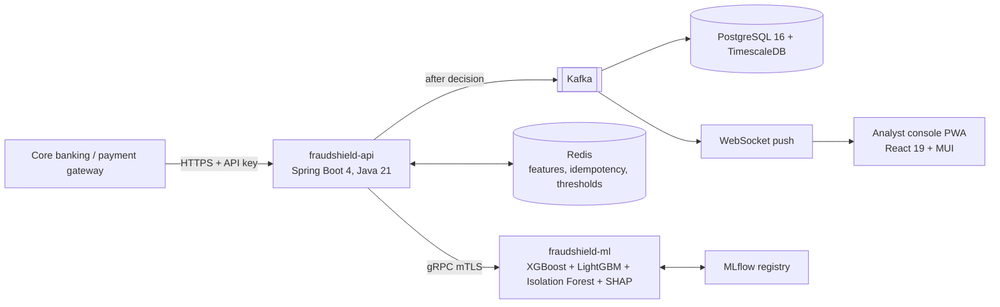

# FraudShield

Real-time explainable fraud detection and analyst intelligence platform for East African
digital payments: mobile money, USSD, agent banking, cards, online and bank transfers across
Rwanda, Kenya, Tanzania, Uganda and the DRC.

> **Project status: M2 — the synthetic dataset generator.** M0 (bootstrap and governance) and
> M1 (contracts and database) are complete. The dataset generator exists and is verified at
> 1,006,249 rows; no fraud model or running service is implemented yet. This README states only
> what exists and has been verified; measured results are given with their scale and the run
> that produced them.
> FraudShield is an independent research project. It is not deployed at, endorsed by, or
> validated with any financial institution or regulator.

## Why

Most published fraud-detection models are trained on card transactions from Europe and North
America. East African payments differ in ways those models do not capture: USSD transactions
from feature phones have no device fingerprint, agent cash-in/cash-out has no card
equivalent, round-sum transfers are normal behaviour, and EAC cross-border corridors are
regional rather than foreign. FraudShield is designed for that context: a streaming decision
path that blocks high-risk payments within a strict latency budget, SHAP explanations for
every flagged transaction, and an analyst console built for low-end Android devices on 3G.

Quantitative claims about the regional fraud landscape that appear in the requirements
document are tracked in [`docs/research/claims_register.md`](docs/research/claims_register.md)
and are not repeated here until verified against primary sources.

## Planned architecture



Synchronous decision path with an asynchronous durability path; full design in the build
specification (`docs/prompts/`) and ADRs (`docs/adr/`).

## Repository map

| Path | Contents |
|---|---|
| `backend/` | Spring Boot services (Maven multi-module) — `common` money/currency primitives today |
| `ml/` | Python ML package (`ml/src/fraudshield_ml`) — operating-point analysis today |
| `frontend/` | Staff console — WCAG contrast utilities today |
| `tools/` | Governance tooling: defect register, traceability matrix, scope guard |
| `docs/srs/` | Requirements (SRS v1.0) and the binding defect register |
| `docs/adr/` | Architecture decision records |
| `dataset/` | Synthetic dataset generator, realism and anti-leakage checks, release export |
| `docs/traceability/` | Requirements ↔ tests ↔ evidence (258 rows) |
| `docker-compose.yml` | Local stack: Kafka, PostgreSQL + TimescaleDB, PII vault, Redis, MLflow, fakes |

## Dataset

`dataset/` generates **FraudShield-EAC-Transactions**: 24 months of transactions, labels and
account events across five countries, as partitioned Parquet with a CSV copy at export. It is
synthetic. Nothing in it comes from a real customer or a real institution, and results measured on
it are results on a synthetic benchmark (D-08).

```console
$ uv run fs-dataset generate --rows 1000000 --seed 20260917 --output /tmp/fs
$ uv run fs-dataset report /tmp/fs --rows 1000000 --seed 20260917
```

**The smallest run that contains the whole dataset is about 170,000 rows.** Below that the
mule-account role pool is usually empty, so a smaller run would hold seven of the eight fraud
scenarios. The generator refuses such a run and names the size that would work. Pass
`--allow-missing-scenarios` to generate anyway for development; the scenarios that could not be
staged are then recorded in `manifest.json` under `scenarios_not_staged`, so a deficient dataset
says so about itself. See the datasheet for how the figure is derived.

Verified at 1,006,249 rows (seed 20260917): fraud rate 0.870% overall and 0.905% in the test
period, all 24 monthly intervals covering their target, channel mix within 0.16 pp, country mix
within 0.01 pp, and every anti-leakage gate passing. The release target of 5,000,000 rows has not
yet been run (ML-DATA-01 is `VERIFIED_AT_REDUCED_SCALE`). Raw figures:
`dataset/realism_report.md`; description: `docs/ml/datasheet.md`.

## Quickstart (development)

There are two supported environments (ADR 0010).

### Option A — GitHub Codespaces (full stack, Docker included)

Recommended for anything that needs Docker: the compose stack, Testcontainers, database security,
integration and chaos suites.

1. On the repository page on GitHub, choose **Code → Codespaces → ⋯ → New with options…**.
2. Select the branch, and a machine type with **4 cores and 16 GB RAM** (the devcontainer declares
   this as its minimum).
3. Wait for creation. `.devcontainer/post-create.sh` installs the pinned toolchains (checksum-
   verified), all locked dependencies and the git hooks, then runs `REQUIRE_DOCKER=1 make ci`,
   which includes starting the core stack and its smoke test. Its output is in the creation log.
4. In the Codespaces terminal:

```bash
make up            # core stack; waits until every service is healthy
make smoke         # functional checks: TimescaleDB, Redis, Kafka, S3 bucket, MLflow artifact
make ps            # status; MLflow on port 5000, Mailpit on 8025 (see the Ports tab)
make down          # stop (volumes kept)
```

### Option B — a local machine without Docker

Everything that does not need Docker runs locally: unit tests, lint, type checks, governance,
licence checks, and later feature code and reduced-scale ML training.

Prerequisites (exact versions in `.tool-versions`): Java 21, `uv`, Node 24 with `pnpm`. The
Docker CLI is used only to validate `docker-compose.yml`; no daemon is needed.

```bash
make bootstrap     # locked Python, Node and Maven dependencies; pre-commit hooks
make ci            # all checks; Docker suites print "SKIPPED: … requires Docker, verified in CI"
```

Docker-dependent suites never skip silently: CI runs them on every push with `REQUIRE_DOCKER=1`,
which turns a missing Docker daemon into a failure. `make up` generates a git-ignored `.env` with
random local credentials on first run. The stack is for **synthetic data only**.

Performance numbers are never taken from CI runners; see `docs/benchmarks/hardware.md`.

## Governance

- Every requirement, SRS table row and defect resolution has a row in
  [`docs/traceability/requirements_matrix.md`](docs/traceability/requirements_matrix.md);
  tests link to rows by tag. CI fails on unknown tags, on completed rows whose evidence is not an
  existing path, commit or CI run, on deviations that are not existing ADRs, and on requirement
  rows that differ from the SRS-derived seed (ADR 0004).
- Deviations from the SRS are recorded in [`docs/srs/defect_register.md`](docs/srs/defect_register.md)
  and `docs/adr/`.
- Milestone reviews are recorded in `docs/reviews/`.

## Licence and citation

Source code: Apache-2.0 (`LICENSE`). Citation metadata: `CITATION.cff` (no DOI has been
issued yet).
